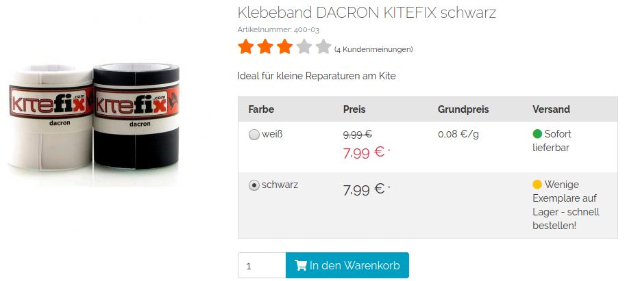

# Description

1. Always load the first variant. Parent will never display within the list views and on the detail page.
2. Display a table instead of select box on normal variants. Multidimensional variants untouched.
3. Display always merged rating at variants. All variants has the same rating (stars)

## Installation

1. Copy files into following directory
        
        source/modules/rs/variantview
        
2. Add to composer.json at shop root
  
        "autoload": {
            "psr-4": {
                "rs\\variantview\\": "./source/modules/rs/variantview"
            }
        },

3. Refresh autoloader files with composer.

        composer dump-autoload
        
5. Enable module in the oxid admin area, Extensions => Modules